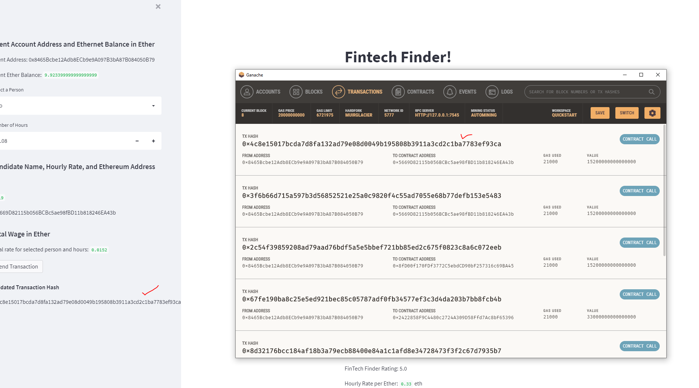
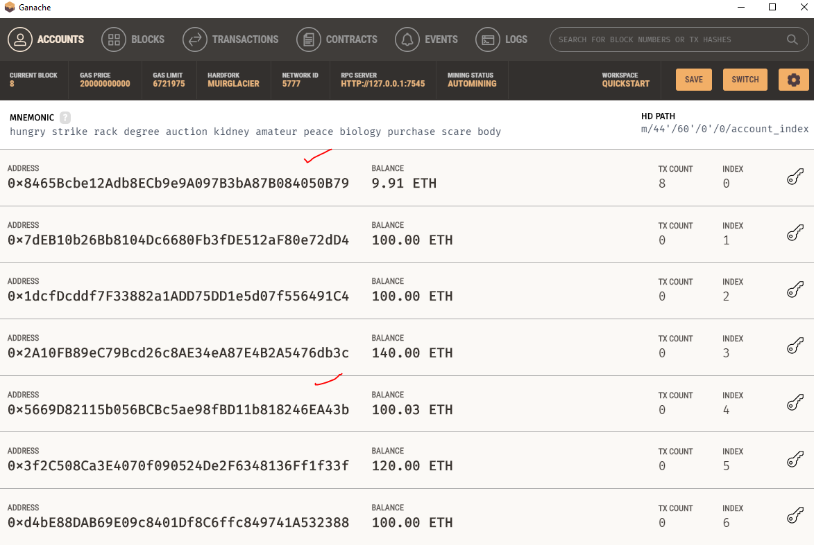

# Fintech Finder

Fintech Finder is an application that its customers can use to find fintech professionals from among a list of candidates, hire them, and pay them. It has integrated the Ethereum blockchain network into the application in order to enable customers to instantly pay the fintech professionals whom they hire with cryptocurrency.

Through this application, which has been developed using Streamlit, WEB3 and Python,

Fintech Finder can do the following:

- Fetch and display the account balance associated with your Ethereum account address, provided by Ganache.
    
- Calculate the total value of an Ethereum transaction, including the gas estimate, that pays a Fintech Finder candidate for their work.
    
- Digitally sign a transaction that pays a Fintech Finder candidate, and send this transaction to the Ganache blockchain.
    

We have used following libraries to create basic functions for transaction execution,

> from bip44 import Wallet
> 
> from web3 import Account
> 
> from web3 import middleware
> 
> from web3.gas\_strategies.time\_based import medium\_gas\_price_strategy

From the crypto_wallet module, we then import the functions created into the Streamlit code -

> from crypto\_wallet import generate\_account,get\_balance , send\_transaction

The final Fintech Finder application looks like this,

#### Sign and Execute a Payment Transaction

Here we see the initial account balance in the client's account, observed in Gnache -

After We have selected the candidate, Jo, in this scenario and selected the number of hours to hire for, 0.08, in this scenario, we have decided to hire the candidate and execute the send transaction action.

We can see above, the transaction as returned by our application and match it against Gnache to validate the success of transaction.

#### Inspect the Transaction

Let's not check the account balance in the client's account after the above transaction,

==We can see a difference  from initial and final.==

Here is a snapshot of all transactions under the client's Gnache account -

Transaction detail of the transaction executed,

We can also view the video of the transaction,

[streamlit-fintech_finder-2022-04-14-11-04-32.webm](streamlit-fintech_finder-2022-04-14-11-04-32.webm)